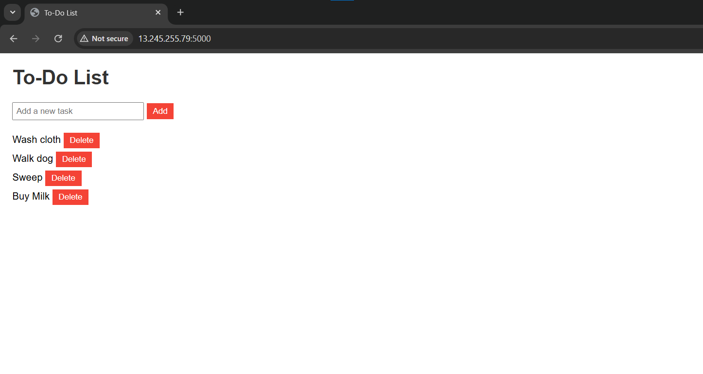

---

# Flask To-Do List

A simple web app to manage tasks, built with Flask, SQLite, and Docker.



## Purpose
I created this Flask To-Do List app to practice writing Dockerfiles and understand containerization. It’s a beginner-friendly project that demonstrates how to package a Python web app with persistent data using Docker volumes.

## Features
- **Add Tasks**: Submit new tasks via a form.
- **View Tasks**: See all tasks in a list.
- **Delete Tasks**: Remove tasks with a button.

If you find this project useful, please give it a ⭐ on GitHub!

## Requirements
- **Docker**: Installed on your host machine (e.g., a VM or local system). [Install Docker](https://docs.docker.com/get-docker/) if you don’t have it.

## Running the App
Follow these steps to run the app with persistent data:

1. **Build the Docker Image**:
   ```bash
   docker build -t flask-todo-app .
   ```

2. **Run the Container**:
   ```bash
   docker run -p 5000:5000 -d -v flask-todo-data:/to-do-app/instance flask-todo-app
   ```
   - `-p 5000:5000`: Maps port 5000 on your host to the container.
   - `-d`: Runs the container in detached mode (background).
   - `-v flask-todo-data:/to-do-app/instance`: Uses a named volume to persist `tasks.db`.

3. **Access the App**:
   - Open `http://localhost:5000` in your browser (or `<ec2-public-ip>:5000` if on a remote server like EC2).
   - Add tasks, delete them, and test the UI.

4. **Stop and Restart**:
   - Stop the container: `docker stop <container-id>` (find the ID with `docker ps`).
   - Restart with the same `docker run` command—your tasks will persist thanks to the volume.

## Data Persistence
- **How It Works**: Without a volume, changes to `tasks.db` (e.g., new tasks) are lost when the container stops, as containers are stateless. The `-v flask-todo-data:/to-do-app/instance` flag maps the `instance/` folder to a Docker-managed volume (`flask-todo-data`), storing `tasks.db` outside the container’s ephemeral file system.
- **Result**: Tasks remain available across container restarts as long as you reuse the same volume.

## Viewing `tasks.db` Contents
The SQLite database (`tasks.db`) is stored in the `flask-todo-data` volume, not your local working directory. To inspect it:

1. **Run a Temporary Container**:
   ```bash
   docker run --rm -v flask-todo-data:/data -it ubuntu:20.04 bash
   ```

2. **Inside the Container**:
   ```bash
   apt-get update && apt-get install -y sqlite3  # Install SQLite if needed
   ls /data  # Verify tasks.db exists
   sqlite3 /data/tasks.db
   .tables  # Shows "Task" table
   SELECT * FROM Task;  # Lists all tasks
   .exit
   ```

3. **Alternative**: Use a bind mount (`-v $(pwd)/instance:/to-do-app/instance`) instead of a named volume to keep `tasks.db` in your local `instance/` folder for easier access.

**Note**: The temporary container (`--rm`) auto-deletes after exiting and doesn’t affect the volume.

## Testing and Verification
- **Initial Run**: Add tasks like “Buy milk” or “Walk dog”—they’re saved to `tasks.db`.
- **Persistence Check**: Stop and restart the container with the same `docker run` command. Tasks should still appear.
- **Volume Inspection**:
   ```bash
   docker volume ls  # Lists volumes, including "flask-todo-data"
   docker run --rm -v flask-todo-data:/data ubuntu:20.04 ls /data  # Confirms tasks.db
   ```

## Project Structure
- `app.py`: Flask app, database logic, and routes.
- `templates/index.html`: HTML template for the UI.
- `static/styles.css`: Basic CSS styling.
- `instance/tasks.db`: SQLite database (created at runtime).
- `Dockerfile`: Instructions to build the container image.
- `requirements.txt`: Python dependencies.

## Notes
- **Dependencies**: Pinned to `Flask==2.0.1`, `Flask-SQLAlchemy==2.5.1`, `Werkzeug==2.0.3`, and `SQLAlchemy==1.4.46` for compatibility as of March 2025. Update versions carefully to avoid breaking changes.
- **Error Handling**: The `delete` route uses `get_or_404` for 404 errors on invalid task IDs.
- **Security**: This is a learning example—no CSRF protection or authentication. Add these for production use.

---
